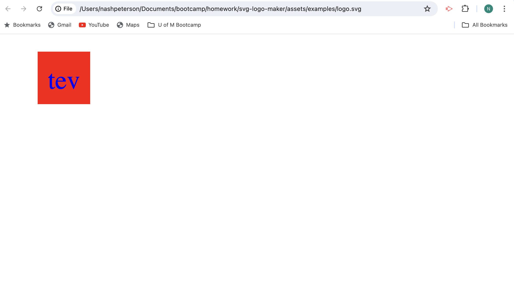

# Module 10 - SVG Logo Maker

For this assignment, I created a simple SVG logo generator application with the following functionalities:

### INDEX.JS
- After initializing node.js, inquirer ver.8.2.4 & all supporting documents like .gitignore.
- Referenced all the necessary files within 'require' variables, individual class constructors and 'writeFile' instructions to create the SVG inside the 'Examples' folder. 
- Housed within an async function - awaiting the user's input from the inquirier prompt inside the "questions" file.
- Passing the generated 'logo.svg' inside the "examples" folder.

### QUESTIONS.JS
- Used a series of inquirer prompts to gather user data to generate the SVG logo (shape, shapeColor, logoText, logoColor)
- Used an array with both color names & hexidecimal values to validate the hundreds of potential colors for both 'logoColor' & shapeColor values.

### SHAPE.JS
- Created a 'Shape' constructor class with ("name", shapeColor, logoText, logoColor) to house the global variables shared between all 3 shapes (Circle, Triangle, Square).
- Linked the 'Circle', 'Triangle', 'Square' class constructors to the 'Shape' class.
- Created functions to raise the 'Shape' constructor values globally (for the JEST test).

### CIRCLE.JS, SQUARE.JS, TRIANGLE.JS
- After referencing and linking the 'Shape' class to each of the 3 shapes, created a render function with template literal strings to dynamically enter the user input and format the SVG coordinate values.

### SHAPES.TEST.JS
- After referencing the 3 individual Shape classes, wrote and passed jest tests for all 3 Shape classes:

EXAMPLE:

const shape = new Square("purple","yellow","rts");
        shape.colorShape("purple") 
        shape.colorText("yellow") 
        shape.spellText("rts")
        expect(shape.render()).toEqual(
`<svg version="1.1" width="300" height="200" xmlns="http://www.w3.org/2000/svg"><rect x="90" y="40" width="120" height="120" fill="purple" /><text x="150" y="125" font-size="60" text-anchor="middle" fill="yellow">rts</text></svg>`)

## Link to Deployed Version

[Click here to see the deployed version](https://drive.google.com/file/d/1ZnNjk6-DfLF6ptQ7P7XIdMu6qe2GDfC0/view)

## Screenshot of the Deployed Version

